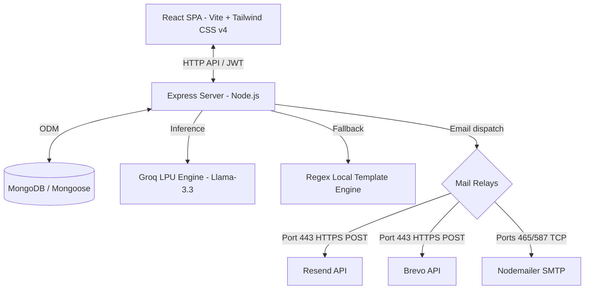

# 🌌 ColdMail.ai Workspace Brain Analysis

This document stores a comprehensive architectural analysis, code breakdown, file mapping, and flow analysis of **ColdMail.ai (AI-Powered Cold Outreach Campaign Generator)**.

---

## 🏗️ 1. High-Level Architecture & Stack

ColdMail.ai is constructed as a decoupled **Client-Server Monorepo**:



### Technical Stack
* **Frontend**: React (v19) + Vite + Tailwind CSS v4 + React Router DOM (v7) + Axios.
* **Backend**: Node.js + Express + MongoDB/Mongoose + JSON Web Tokens (JWT) + Nodemailer + Groq SDK.
* **Hosting Adaptations**: Dual HTTPS mail relays (Resend, Brevo) to bypass default outbound SMTP port blocks in services like Render.

---

## 📂 2. File Directory Mapping

The codebase is organized into two primary sub-workspaces: `client` and `server`.

```
ai-cold-mail-generator/
├── client/                     # Vite React Frontend
│   ├── src/
│   │   ├── components/         # Reusable structural & UI elements
│   │   │   ├── Header.jsx      # Navigation header with session logout & auth routing
│   │   │   ├── Footer.jsx      # Static footer
│   │   │   └── Loader.jsx      # Glowing overlay indicator during AI generation
│   │   ├── context/            # Global context state
│   │   │   └── AuthContext.jsx # Auth state, login/logout mechanisms, API registration/login wrappers
│   │   ├── pages/              # Main view screens
│   │   │   ├── Landing.jsx     # Landing page showcasing core value props
│   │   │   ├── Login.jsx       # Email-password validation screen
│   │   │   ├── Signup.jsx      # Name, email, password signup and OTP trigger
│   │   │   ├── VerifyOtp.jsx   # 6-digit OTP activation check
│   │   │   └── Dashboard.jsx   # Core Workspace containing generation panel and history details
│   │   ├── utils/              # Utility configurations
│   │   │   └── axios.js        # Customized Axios instance with baseURL dynamic resolver & JWT interceptors
│   │   ├── App.jsx             # Main routing setup with Route Guards (Public vs Protected)
│   │   └── index.css           # Design tokens, glassmorphic styles, keyframes, and animations
│   ├── tailwind.config.js      # Tailwind theme extensions (colors, fonts, box shadows)
│   └── package.json            # Client dependency declarations
│
└── server/                     # Backend API Node App
    ├── config/
    │   └── db.js               # MongoDB Mongoose connector
    ├── controllers/
    │   ├── authController.js   # JWT generation, signup/login flow, OTP creation/validation logic
    │   └── emailController.js  # Campaign creation endpoints & history query managers
    ├── middlewares/
    │   ├── authMiddleware.js   # Token bearer resolver & verification wall
    │   └── errorMiddleware.js  # Global Express catch-all error formatters
    ├── models/
    │   ├── User.js             # Mongoose Schema: Users, passwords, verification codes
    │   └── EmailHistory.js     # Mongoose Schema: Historic campaign subjects, body, LinkedIn DM, follow-up templates
    ├── routes/
    │   ├── authRoutes.js       # Mounts /api/auth endpoints (register, verify-otp, login)
    │   └── emailRoutes.js      # Mounts /api/email endpoints (generate, history)
    ├── utils/
    │   ├── Groqai.js           # Groq client execution handler & localized fallback engine
    │   └── sendEmail.js        # Multi-channel mail sender (Mock, Resend, Brevo, SMTP)
    ├── server.js               # Express entrypoint
    └── package.json            # Node backend packages
```

---

## 🔒 3. Authentication & Verification Flow

The system employs a JWT-based session security setup combined with an OTP email validator:

```
[ Signup Form ] ──> Sends Name, Email, Password
                         │
                         ▼
             Generates 6-Digit OTP & Expiry (10m)
                         │
                         ▼
             Dispatched via sendEmail()
                         │
                         ▼
[ OTP Verification Form ] ──> Validates code
                         │
                         ▼
             Marks isVerified = true ──> Generates JWT Token
```

### Route Protections (`client/src/App.jsx`)
* **`ProtectedRoute`**: Inspects `isAuthenticated`. Blocks unauthenticated traffic, redirecting them to `/login`.
* **`PublicRoute`**: Intercepts logged-in users who try to view `/login`, `/signup`, or `/verify-otp` and redirects them straight to the `/dashboard` workspace.

---

## 🤖 4. AI Generation & Fallback Mechanics (`server/utils/Groqai.js`)

When generating campaigns, the server requests structured JSON output from **Llama-3.3-70b-versatile** with the following schema:
```json
{
  "subject": "intriguing subject (under 7 words)",
  "body": "cold email body (under 180 words, placeholders [Recipient Name], [Company Name], and [Your Name])",
  "linkedinDm": "conversational connect DM (under 300 characters)",
  "followUp": "brief follow-up template (under 80 words)"
}
```

### Smart Fallback Engine
To handle instances where `GROQ_API_KEY` is missing or when the API hits rate limits, the module implements a local regex-based fallback:
1. **Company Extraction**: Inspects the user's prompt using matching expressions (e.g. `at [Company]` or `to [Company]`).
2. **Role & Skill Mapping**: Scans for keywords in the prompt to match standard titles and services (e.g. "React" maps to "React Developer" specializing in "React & frontend optimization").
3. **Tone Compilation**: Standard templates are compiled for the matching Tone (`Professional`, `Persuasive`, `Casual`).
4. **Cohesive Sequence Creation**: Returns a complete layout containing a valid Subject, Body, LinkedIn DM, and Follow-Up.

---

## ✉️ 5. Mail Relay Dispatcher Options (`server/utils/sendEmail.js`)

The email handler is configured to automatically adapt to its runtime environment to prevent email port blocks:

1. **Mock Driver (`USE_MOCK_EMAIL=true`)**: Bypasses any outbound networks. Outputs OTP codes directly in the console, enabling local offline developer testing.
2. **Resend HTTP API (`RESEND_API_KEY`)**: Sends a standard HTTPS request to `https://api.resend.com/emails` over port 443. Ideal for standard cloud environments.
3. **Brevo HTTP API (`BREVO_API_KEY`)**: Sends a standard HTTPS request to `https://api.brevo.com/v3/smtp/email` over port 443.
4. **Nodemailer SMTP**: Relays standard TCP SMTP sessions using configurations like `EMAIL_HOST`, `EMAIL_PORT`, `EMAIL_USER`, and `EMAIL_PASS`.

---

## ⚙️ 6. Environment Configurations Checklist

Create a `.env` file in the project root directory with the following options:

| Variable | Usage / Value Example | Description |
| :--- | :--- | :--- |
| **`PORT`** | `5000` | Local web port for backend |
| **`MONGODB_URI`** | `mongodb://127.0.0.1:27017/cold-mail-generator` | Connection string |
| **`JWT_SECRET`** | `your-jwt-signing-secret` | Cryptographic secret for user sessions |
| **`USE_MOCK_EMAIL`** | `true` or `false` | Developer testing check |
| **`GROQ_API_KEY`** | `gsk_your_api_key_here` | Groq console API token |
| **`RESEND_API_KEY`** | `re_xxx` | Optional HTTP Resend mail token |
| **`BREVO_API_KEY`** | `xkeysib-xxx` | Optional HTTP Brevo mail token |
| **`EMAIL_HOST`** | `smtp.gmail.com` | SMTP Server |
| **`EMAIL_PORT`** | `587` or `465` | SMTP port |
| **`EMAIL_USER`** | `example@gmail.com` | Send credentials |
| **`EMAIL_PASS`** | `app-specific-password` | Mail access password |
